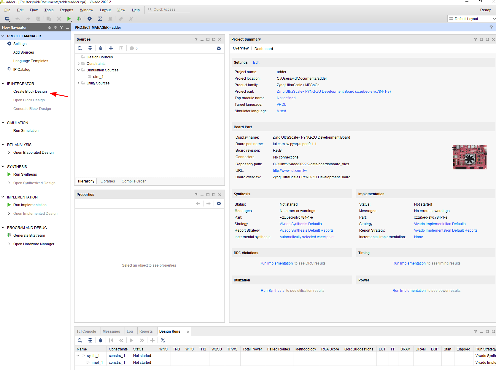

# HDL on PYNQ

A guide on how to package HDL code (VHDL or Verilog) for PYNQ environments.

The [official documentation](https://pynq.readthedocs.io/en/latest/overlay_design_methodology/overlay_tutorial.html) for creating PYNQ overlays is rather limited.
It only shows how to use HLS code and even then it skips many important steps.
The purpose of this guide is to better show how to get your VHDL or Verilog project running on your PYNQ board.

I have a PYNQ-ZU board, but the process should be similar on other boards as well.

## Overview

In order to use HDL code on a PYNQ board you have to package it into an IP with an AXI interface, combine it with a ZYNQ processor and upload the compiled bitstream (and some other files) to the board.

## Demo project

For the purposes of this guide I'll be making a module that adds two 32-bit numbers `a` and `b`,
and returns the result `c`.

| Signal/Register | Direction | Size   | Offset | Signal in HDL |
|-----------------|-----------|--------| -------| --------------|
| `a`             | input     | 32 bit | `0x00` | `slv_reg0`    |
| `b`             | input     | 32 bit | `0x04` | `slv_reg1`    |
| `c`             | output    | 32 bit | `0x08` | `slv_reg2`    |

PYNQ needs to know the register offset to interface with the overlay.
Column `Signal in HDL` will be important when integrating your logic into a pregenerated file.
You can map your signals (`a`, `b`, ...) to the internal registers (`slv_reg0`, `slv_reg1`, ...) in any way you want).

## Creating a new project

First you need to create a new project in Vivado.
In this project we'll combine your IP and the ZYNQ processor.

You can name it anything you want, for example `adder`, and save it somewhere convenient.

On the next window select `RTL Project` and optionally also check `Do not specify sources at this time`.
You do not have to check it, but it will save you clicking `Next` on two windows.

Then select your board. If you can't find it you might first need to add board files to Vivado.
Instead of specifying the board you can also choose the part if you know it.

Then just click `Finish` and the project should be created.
You should see something like this.
Notice that my target language is VHDL.
If you're developing in Verilog you should change this now as it will affect the files generated in later steps.

## Package your code into an IP

After you successfully created a new Vivado project you have to create another project for your IP.
To do this go to `Tools` > `Create and Package New IP`.

In the Create and Package New IP wizard first click Next.
Then select `Create new AXI4 peripheral`.

Write a name, package name and a description for your package.
In my case I'll write `adder` both for name and package name (this will be the name of the IP).

On the Add interfaces screen you can choose how many registers your application requires.
In my case I need just 3, but 4 is the lowers number possible, so I'll choose that.
You can leave everything else as is.

On the last step select `Edit IP` and click `Finish`.

Notice that the wizard created a new file and added it to your design sources.
This is the code required for AXI communication.
This file will be generated either as a VHDL file or a Verilog file depending on your target language.

Next you need to add your own logic to this generated file.
Open it and scroll to the bottom.
Here you can write your own logic or integrate your own modules.

The following steps are for VHDL but if you're writing Verilog the process is exactly the same,
except the syntax is a bit different.
If you get lost you can try [this guide](https://discuss.pynq.io/t/tutorial-creating-a-new-verilog-module-overlay/1530) which focuses on Verilog.

To input data into your logic you can use signals `slv_reg0`, `slv_reg1` and so on.
There are as many registers as you chose when creating the IP (in my case 4).

Notice that I used registers `slv_reg0` and `slv_reg1` as inputs for my logic but for output I am using a signal called `sum`.
**This is important**.
While theoretically you could output directly to an internal register (such as `slv_reg2`) that does not work because it will not be updated correctly, and you won't get the correct result.
I am sure there is a way to make it work even without extra signals I think this is an easier workaround.

Vivado is reporting an error on line 389.
That is because `sum` is not defined yet.
You can define your own signals anywhere before the `begin` statement, which is located around line 120.
Now the error should be gone.

The last thing you need to modify in this file is to modify the process that writes to registers.
Normally the CPU writes to them but in this case we want to expose our signals to the outside.
In my case I want the value of signal `sum` to be available to the outside world.

To do this, find the process (it should be around line 215) and do the following:

- Connect your signals to the internal registers.
In my case that means connecting `sum` to `slv_reg2`.
Do this outside the switch statement to make sure the register is always refreshed.
- Comment out or delete all switch cases for your output registers.
In my case my output register is `slv_reg2`, so I'll comment out the code from `when b"10" =>` to the `end loop;`
- comment out or delete the statements for your output registers in the `when others` block

At the end your process should look similar to this.
The code I changed is outlined in red.

Now you can save and close this file and open the `Package IP` window.
Here find the `File groups` tab and click `Merge changes from File Group Wizard`

After that all tabs on the right (except Review and Package) should have a green checkmark.

This next step is optional but recommended to make sure PYNQ knows the offsets of each register used (without this you'll have to manually specify register offsets for reading and writing).
Go to `Addressing and Memory` tab and right click on `S00_AXI_reg` address block.
Then click `Add register` and specify a name. Repeat this for all your registers.

After you've added all your register you have to write their display names (this is what PYNQ uses to identify registers), descriptions, their address offset and size (both in bits).
This is where the `Offset` and `Size` columns of the table above come in handy.

Finally, everything is ready to be packaged.
Go to the `Review and Package` tab and click `Re-Package IP`.
After the IP is packaged you can close this project and return to the previous one.

## Add IP to your project

The next step is to create a new block design where we'll combine the newly created IP with a ZYNQ processor.

First click the `Create Block Design` button the left.
You can name the design anything you want.

Next add your IP and a ZYNQ processor to the design by clicking the + on the Diagram window or in the toolbar.
In my case my IP is called `adder` and the ZYNQ processor is called `Zynq UltraScale+ MPSoc` (it's the last one on the list).

After your add both IPs you'll see a green `Designer Assistance available` notification at the top of the Diagram window.
Click `Run Block Automation` and `Run Connection Automation` buttons to connect both IPs.
You might need to click easy button multiple times to get everything connected.

At the end you should have something like this.
The exact layout may be a bit different but on the whole it should be similar.

Next you need to create a HDL wrapper for this block design.
To do this go to the `Sources` tab, right click on your design and click `Create HDL Wrapper`.
In the popup keep the default option (`Let Vivado manage wrapper and auto-update`)

Next click the `Generate Bitstream` button and wait for it to be generated.

After the bitstream is generated export the block diagram.
To do this go to `File` > `Export` > `Export Block Design`.
You can leave the default name and location as we'll change is later anyway.
This will create a `.tcl` file which PYNQ needs to recognize your bitstream as an overlay.

## Use your overlay on your PYNQ board

To upload the generated bitstream and other required files we'll use SMB.
This works particularly well on Windows, but I am sure there are equally simple methods on Linux as well.

To connect to your board simply type `\\pynq` into the path input of File Explorer.
When you first connect it'll ask for a username and a password.
Both are `xilinx`.

I like to create a new folder for each overlay.
These folders can be located almost anywhere, but I prefer to keep them in `\\pynq\xilinx\pynq\overlays`.

In this case I'll keep files for my `adder` module in the folder `\\pynq\xilinx\pynq\overlays\adder`

To create a new layout you need to copy the following files to your board:

- a `.bit` file (the bitstream that will be loaded onto the FPGA)
- a `.tcl` file (this is the file you created by exporting the Block Diagram. PYNQ needs this to recognize your bitstream as an overlay)
- a `.hwh` file (this is optional but is needed if you want PYNQ to recognize register names)

By default, the files are in these folders relative to your project root (the name might be different depending on what how you named your block design but in all cases there is only one file with that extension in each folder):

- `adder_design.tcl`
- `adder.runs\impl_1\adder_design_wrapper.bit`
- `adder.gen\sources_1\bd\adder_design\hw_handoff\adder_design.hwh`

Copy all these files to your board and make sure they all have the same name.

Now you can open the Jupyter web interface (`http://pynq:9090/lab`) and create a new notebook.
The password is `xilinx`.

In the notebook you can use the overlay in exactly the same way as in the [official documentation](https://pynq.readthedocs.io/en/latest/overlay_design_methodology/overlay_tutorial.html).
For example:

## References

This guide is based on the following articles and guides:

- <https://pynq.readthedocs.io/en/latest/overlay_design_methodology/overlay_tutorial.html>
- <https://pynq.readthedocs.io/en/latest/overlay_design_methodology/overlay_design.html#overlay-hwh-file>
- <https://www.fpgadeveloper.com/2014/08/creating-a-custom-ip-block-in-vivado.html/>
- <https://discuss.pynq.io/t/tutorial-creating-a-new-verilog-module-overlay/1530>
- <https://www.fpgadeveloper.com/2018/03/create-a-custom-pynq-overlay-for-pynq-z1.html/>
